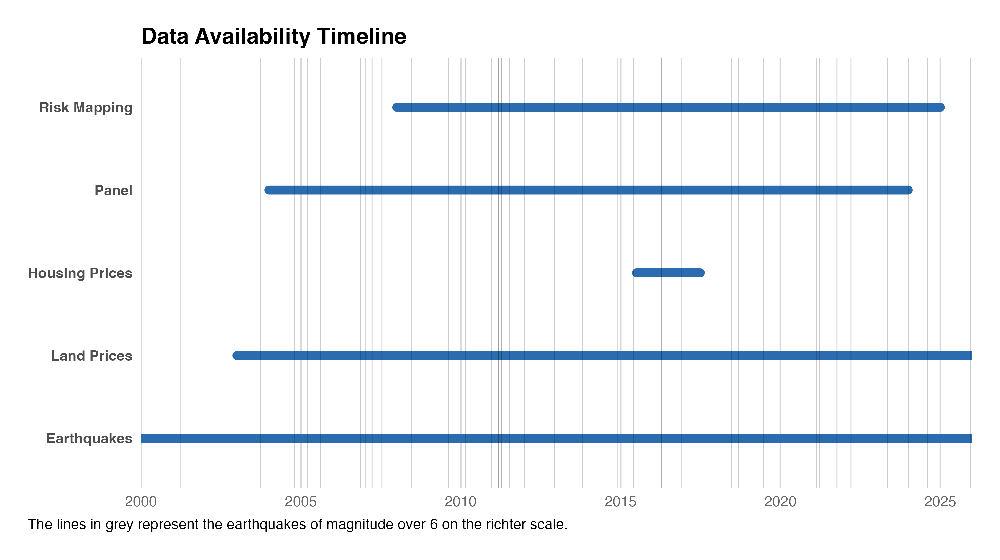

:::::::::: column-page
::::::::: columns
::: {.column width="49%"}
## Real Estate Data

<strong style="font-size: 1.25em;">LIFFULL HOMES Listings</strong>

LIFFUL'HOMES is one of the major real estate companies in Japan. The dataset includes housing listings with extremely high quality details.

-   Website: https://lifull.com/en/
-   70GB

<strong style="font-size: 1.25em;">MLIT Land Prices</strong>

-   Website: https://www.mlit.go.jp/en/
-   ?GB

:::

::: {.column width="2%"}
:::

::: {.column width="49%"}
## Risk Mapping Data

<strong style="font-size: 1.25em;">JMA Earthquake Records</strong>

Japan Meteorological Agency.

-   Website: https://www.jma.go.jp/jma/indexe.html

<strong style="font-size: 1.25em;">J-SHIS Hazard Maps</strong>

*Japan Seismic Hazard Information Station* (https://www.j-shis.bosai.go.jp/en/).

Many maps are available, easy to access and well described. I decide to fo for the so-called "Seismic hazard map." From there, I select "All", meaning I include earthquakes of all categories from I to III. I finally choose the "Average Case" as Probability Case. See download page for more information : <https://www.j-shis.bosai.go.jp/map/JSHIS2/download.html?lang=en>.

:::

::: {.column width="49%"}
## Panel Data

<strong style="font-size: 1.25em;">KSPS Panel Data</strong>

Large Panel from Keio University from 2004.

-   Website: https://www.pdrc.keio.ac.jp/en/paneldata/datasets/jhpskhps/

<strong style="font-size: 1.25em;">GEES Data on earthquakes</strong>

Panel after the 2011 earthquake about what Japanese people think about earthquakes.

-   Website: https://www.pdrc.keio.ac.jp/en/paneldata/datasets/gees/

:::

::: {.column width="2%"}
:::

::: {.column width="49%"}
## Other Useful Data

<strong style="font-size: 1.25em;">E-Stat</strong>

Unemployment data, everything else that could have an impact on prices.

:::
:::::::::
::::::::::

