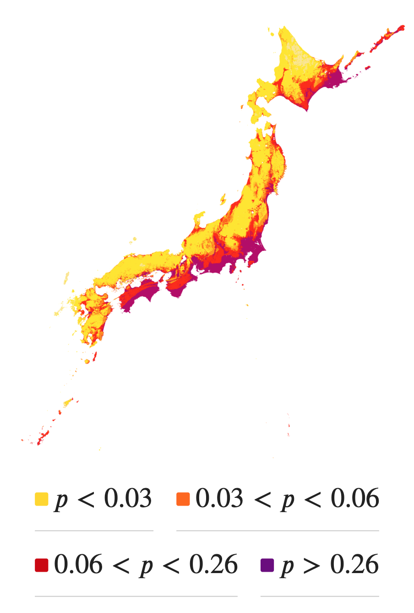

\title{Seismic Hazard Mapping In Japan: the effects real estate prices}
\author{Anthony Rocher}
\date{}
\begin{abstract}

I investigate how housing prices response to risk exposure following big earthquakes as information shocks in Japan. Using a new dataset covering whole Japan from 2015 to 2017 with ??? billions of observations, I use a DiD strategy to determine how much unaffected but still at risk areas react to the occurrence of earthquakes over intensity 5.
    
\end{abstract}

\section{Introduction}

Japan faces a puzzle. While the Japanese government warns about the natural disaster threats in Tōkyo, housing prices keep skyrocketing as people want to go there anyway. Are they aware?

To what extent do natural disaster information shocks change risk aversion in housing prices?

**Research question**: How information shocks such as natural disasters modify risk aversion in housing prices depending on exposure to risk?

The paper proceeds as follows. Section II presents a brief theory of housing prices under uncertainty. Section III presents Japan's background with earthquakes and describes the data. Section IV outlines my estimation strategy and identification assumptions. Section V presents the empirical results of the risk exposure effects on prices. Section VI uses robustness checks. Section VIII concludes.

\section{A Natural Distaster Risk Model}

Let denote $p$ the subjective probability that a property will be hit by an earthquake. $p$ depends on both the information set $i$ individuals possess about the seismic risks (such as a recent event, media coverage, etc.), and $r$ the objective attributes for earthquakes to be more likely to happen, such as being located right on seismic faults. Note that $\pi$, the objective probability of an earthquake, is included in $i$ in our case, since maps are provided and publicly available. Then the Hedonic Price Function is given by: $$
P = P(Z, r, p(i, r)),
$$ with $P$ denoting the price of the house and Z denoting an additional set of structural, environmental and locational characteristics not related to the seismic hazards maps. Following Brookshire et al. (1985), the location decision of agents is modeled using a state dependent expected utlility function: $$
EU = p(i, r) \cdot U^E[Z, r, Q] + (1 - p(i, r)) \cdot U^{NE}[Z, r, Q],
$$ where $U^E(.)$ is the homeowner's utility in a state in which a earthquake occurs and $U^NE(.)$ is the homeowner's utility when there is no such event. $Q$ is a composite commodity, and the budget constraint of the homeowner is given by: $$
M = P(Z, r, p(i, r)) + Q
$$ Maximising expected utility with respect to $p$ subject to the budget constraint and then dividing through by the expected marginal utility of income results in the following expression: $$
\frac{\partial P}{\partial p}
=
\frac{U^{E} - U^{NE}}
{
p(i,r)\frac{\partial U^{E}}{\partial Q}
+
\left(1 - p(i,r)\right)\frac{\partial U^{NE}}{\partial Q}
}
$$

\section{A Short Litterature Review}

I contribute to the literature on risk aversion in housing prices

\section{Data}

\subsubsection{Real Estate Data}

I use data from \textit{Liffull Homes}, one the biggest real estate companies in Japan. The data consists in listings, covering all prefectures in Japan, from January 2015 to October 2017. The data set contains 27,885,84 observations where the price, the characteristics of the property, and the exact geolocation are available. As there are listings, they are estimations and may slightly differ from the real transaction price. The data mainly contain listings of appartments for rents, but it also includes many var

\subsubsection{Risk Mapping Data}

The risk maps are available from the \textit{Japan Seismic Hazard Information Station}. A webite was created in 2009 to inform people about seism risk, and everyone can take a look at the maps, easily downloadable. They have been uploaded every year since 2009 (expect with 2015). The maps have a high image resolution of 250 meters. There are many seismic risk measures. I choose to use the "probability that each site will be affected by an earthquake of seismic intensity 6 lower or more within 30 years," as this one is described as representative by the J-SHIS itself (J-SHIS, insérer la réf ici).

\subsubsection{Additional Data}

To complete those data, I use some other sources of data. First, I use data from \textit{e-stat} which provides information about demographics, education, health and the labour market in Japan, aggregated at the city level. Data from the population census are available for 2015 and 2020. Other data are missing for some years. To deal with this issue, I use three ways. I use linear interpolation for the census missing values, linear regression and the nearest values for the other missing values. For example, number of habitants for 2023 is derived from the values of 2015 and 2020, number of migrants is derived using linear regression and the number of hospitals for a missing year takes the value of the previous year not missing. See Apendix for each case.

Macroeconomic variables are to take into account when it comes to the housing market. One of the most important is interest rate. Japan's interest rate was extremely stable throughout the period covered by our data, around 1%. Additional macroeconomic variables include growth domestic product and "Indexes of Business Conditions" provided by e-stat. I choose the lagging index, see Apendix for data details.

\subsubsection{Construction of the dataset}

I make a number of sample restrictions. I only keep observations that contain lands, houses or apartments where people live, thus excluding shops, parking, or commercial real estates. As each observation includes latitude and longitude, I match them with Seismic Hazard Maps from the JMA of accuracy 250m \* 250m, in respect of the listing publication year.

I match this data base to the e-stat data, merging by municipalities. I will use the following controls :

-   number of rooms (`rooms`)
-   average room size (`room_sqft`)
-   floor (`floor`)
-   `age_g`
    -   age \< 3
    -   after the Tohoku earthquake (from 2011)
    -   after the Kobe earthquake (1995 - 2010)
    -   after the para-sismic law (1981 - 1994)
    -   after the City Planning Law (1968 - 1980)
    -   after the WW2 (1945 - 1967)
-   distance to the nearest station as a proxy for distance to the center (`station1_distance`).
-   number of inhabitants of the municipality as a (bad) proxy for density (`pop_total_linear`) -\> to replace by number of inhabitants / municipality size
-   density measured as it follows:
    -   rural if DID (density inhabited districts) does not exist
    -   log(density) otherwize
-   share of migration at the municipality level as a proxy for attractiveness (`net_migration_rate`).

Controls that would be nice to add:

-   Average wages as a proxy for area dynamics

-   Height above the sea level

-   distance to the sea

I obtain the following tables:

\section{Empirical Strategy}

\subsubsection{Treatment Definition}

I use Differences-in-Difference strategy. To better understand what will be the control and the treated group, let's visualize the official 2020 (the latest one) Seismic hazard risk map.

{width="50%"}

This map is constructed from $p$ **which is the probabily that an earthquake of magnitude 6 or more will srike in the next 30 years**. I choose the thresholds according to the official documentation provided by the J-SHIS.

\subsubsection{Equation}

$$
\ln P_{it} = \alpha_0 + \sum_{j=1}^{J} \alpha_j Z_{ij} + \beta r_i + \gamma Exposed_i + \delta Post_{it} + \theta_t (Post_{it} \times Exposed_i) + \varepsilon_{it}
$$

$P_{it}$ is the logarithm of the price of add $i$ at time $t$, $Z$ is a set of structural characteristics of the good. $Post_i$ takes 1 when the advertising is publised within 1 month after a big earthquake occurs.

I obtain the following results if I apply this equation to the data.

I have a problem when it comes to the $Post$ variable, with Stata saying too much co-linearity with the FE. Note that the FE are here $region \times year_-month$. I tried as a first attempt with only $region \times year$, but the same error made me opt for $region \times year_-month$.

With the same error, I have tried for each type of properties:

\section{Robustness checks}

Keeping only a few regions and apply fixed effects at the prefecture level?

\section{Conclusion}
