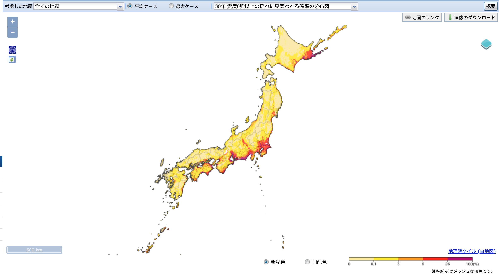
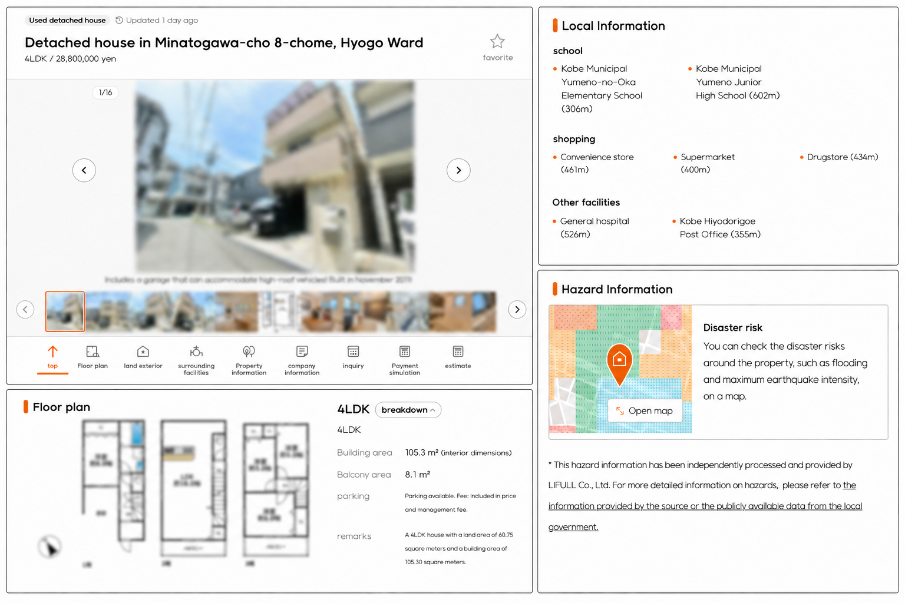
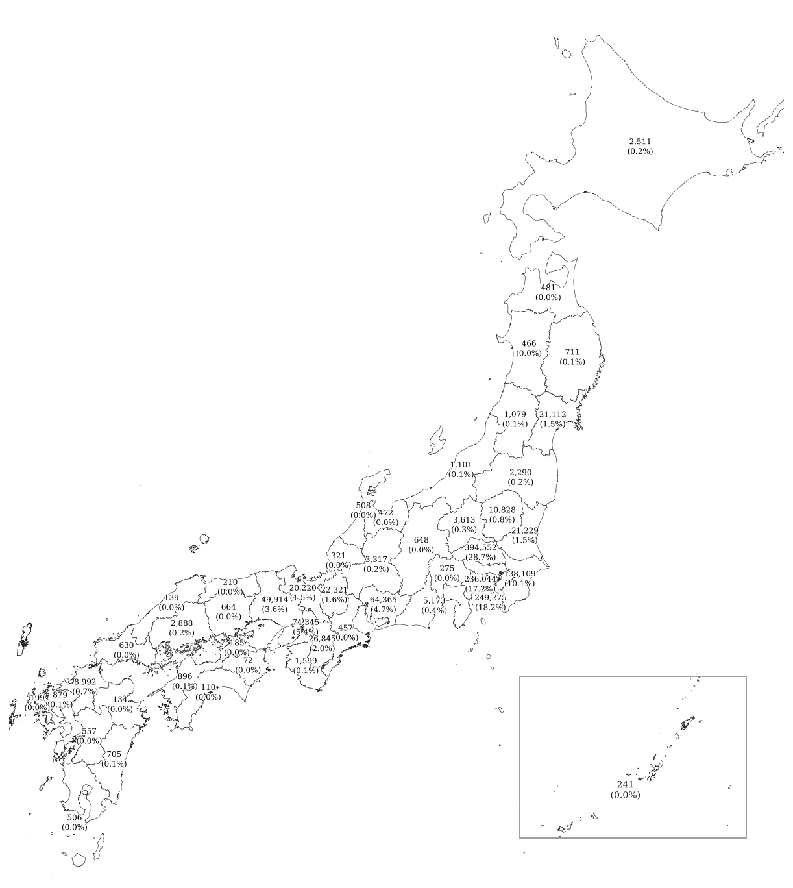
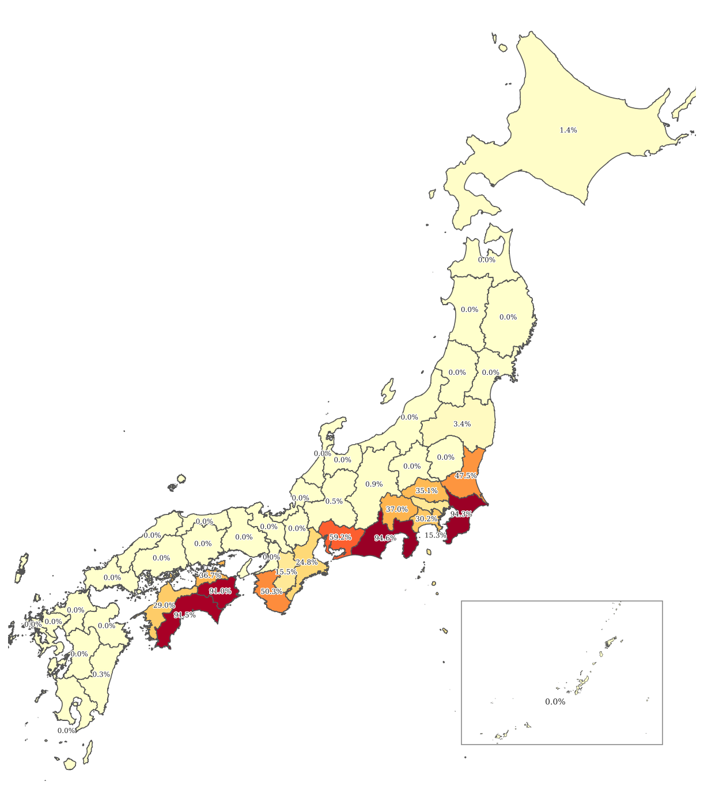

---
format:
  pdf:
    keep-tex: true
    fig-cap-location: top
    fig-subcap: true
    fig-pos: H
    include-in-header:
      - text: |
          \setlength{\skip\footins}{25pt}
header-includes:
  - \KOMAoption{captions}{tableheading,figureheading}
  - \usepackage{tcolorbox}
  - \usepackage{caption}
  - \usepackage{pifont}
  - \usepackage{float}
  - \usepackage{booktabs}
  - \usepackage{threeparttable}
  - \newcommand{\cmark}{\ding{51}}
  - \newcommand{\sym}[1]{\ifmmode^{#1}\else\(^{#1}\)\fi}
bibliography: references.bib
---

\begin{center}
  \vspace*{0.5cm}

  {\LARGE \textbf{Risk Aversion in Housing Prices: \\ Effects of big earthquakes in Japan}} \\
  \vspace{1.0cm}

  {\large \textsc{By Anthony Rocher}\textsuperscript{a}} \\
  \vspace{0.6cm}
  
  {\small \textit{Under the direction of} \textsc{Sophie Buhnik}\textsuperscript{b} \textit{and} \textsc{Florence Goffette-Nagot}\textsuperscript{c}} \\
  \vspace{1.5cm}

  \textsuperscript{a} \small ENS de Lyon, F-69007 Lyon, France. \textit{anthony.rocher@ens-lyon.fr}.\\
  \textsuperscript{b} \small Ecole Supérieure des Professions Immobilières, 92300 Paris, France. \textit{s.buhnik@groupe-espi.fr}. \\
  \textsuperscript{c} \small Cergic, ENS de Lyon, CNRS, F-69007 Lyon, France. \textit{florence.goffette-nagot@cnrs.fr}.
\end{center}

\vspace{0.8cm}

\begin{quote}
\small
\noindent \textbf{Abstract---} I investigate how housing prices response to risk exposure following big earthquakes as information shocks in Japan. Using a new dataset covering whole Japan from 2015 to 2017 with ??? billions of observations, I use a DiD strategy to determine how much unaffected but still at risk areas react to the occurrence of earthquakes of intensity 6 or upper. \textit{(JEL R30, Q54)}
\end{quote}

天災は忘れた頃にやってくる 寺田虎彦

\vspace{1cm}

\noindent "A natural disaster strikes when people lose their memory of the previous one." -- Torahiko TERADA. How households' risk aversion is translated to housing prices? Standard theory suggests that, as information about risk depreciates over time, a recent shock should widen the price differential between high- and low-risk areas, conditional on an increase in the safety premium. However, the extent to which housing markets incorporate such information remains an empirical question.

Understanding how information shocks are capitalized into housing markets provides insight into whether households perceive the risks they face and how much they value newly acquired information. If the elasticity of housing prices with respect to risk exposure is close to zero, disaster-related information may have limited effects on housing markets: prices may fail to function as effective signals of underlying risk. Alternatively, households may recognize the risks but choose to remain in exposed locations, placing little or no monetary value on risk reduction. Conversely, if households fully adjust their location choices in response to new information, high-risk areas may experience declining demand and reduced attractiveness. Over time, this adjustment could lead to lower investment in exposed regions. More broadly, persistent exposure to environmental risk may become a source of inequality, as rising safety premiums make low-risk locations increasingly inaccessible to lower-income households.

In this paper, I study how recent earthquakes affect housing prices depending on properties’ exposure to seismic risk, as measured by their location on official Seismic Hazard Maps. I examine both the magnitude of the safety premium associated with lower-risk locations and how this premium changes following information shocks generated by major earthquakes.

I use a unique dataset from a Japanese real estate agency containing property listings across Japan between October 2014 and December 2017. Using detailed geocoordinates, I match each property to its corresponding level of seismic risk based on the Seismic Hazard Maps provided by Japanese disaster prevention authorities. This combination of high-frequency real estate data and spatial measures of earthquake risk allows me to examine how housing markets incorporate new information about disaster exposure.

**Research question**: How information shocks such as natural disasters modify risk aversion in housing prices depending on exposure to risk?

This paper contributes to the literature on hedonic pricing, initiated by @rosen1974, and to the study of risk capitalization in housing markets. A large body of work has examined how risk perceptions are incorporated into property values, showing that differences in exposure to adverse events are reflected in equilibrium prices (@brookshire_test_1985).

More broadly, this paper contributes to the literature on real estate markets under uncertainty. Previous studies have investigated the impact of natural disasters on housing prices, including floods (@bin_effects_2004, @atreya_forgetting_2013, @atreya_seeing_2015), wildfires (add references), and earthquakes (@beron_analysis_1997, @sato_impact_2021). These papers provide evidence that households update their valuation of properties following major risk-related events, but the extent and persistence of these adjustments remain open questions.

A growing literature has focused specifically on the effects of earthquakes in Japan, often relying on detailed administrative data provided by the Ministry of Land, Infrastructure, Transport and Tourism (MLIT). For example, @naoi_earthquake_2009 and @hidano_effect_2015 use these data to study the capitalization of earthquake risk into land and property values. This paper builds particularly on the work of @ikefuji2022, who show that land prices are \[insert main finding\]. I extend this line of research by examining how earthquake-related information shocks are incorporated into the broader housing market.

While previous work has investigated related questions, existing analyses have often been constrained by limited data availability. This paper leverages a newly available dataset containing billions of highly granular observations, covering both transactions and rental markets for land, houses, and apartments. The richness and accuracy of this dataset allow for a more comprehensive analysis of how housing markets respond to changes in perceived risk. The main contribution of this paper therefore lies in providing new evidence on the adjustment of housing markets following large information shocks, exploiting an unprecedented level of detail in real estate outcomes.

My results are ...........

The paper proceeds as follows. Section II presents a brief theory of housing prices under uncertainty. Section III presents Japan's background with earthquakes and describes the data. Section IV outlines my estimation strategy and identification assumptions. Section V presents the empirical results of the risk exposure effects on prices. Section VI uses robustness checks. Section VIII concludes.

\section{Theoretical Framework}

Let us suppose that information about earthquake risks is available\footnote{Anticipating on the empirical part, such information is displayed on the add, see Table ?}. When making location choices, households may take into account the safety of the place where they choose to locate. Following the hedonic pricing approach, safety is a property attribute, like other attributes including structural, neighborhood, and community characteristics, even though it contains a random component. The basic intuition is that, all else being equal, households should locate along a hedonic price gradient for safety, with higher prices in safer locations. Based on expected utility theory (@exputil), I develop a short theoretical model to capture how information affects housing price formation.

Let $p$ denote the subjective probability that a property will be affected by an earthquake. $p$ depends on both the information set $i$ that individuals possess about seismic risks (such as a recent event, media coverage, etc.) and $r$, the objective attributes that make earthquakes more likely to occur, such as being located near seismic faults. The hedonic price function is then given by $$P = P(Z, r, p(i,r))$$ where $P$ denotes the price of the house and $Z$ denotes an additional set of structural, environmental, and locational characteristics unrelated to the seismic hazard maps. Following @brookshire_test_1985, the location choice of agents is modeled using a state-dependent expected utility function: $$
EU = p(i, r) \cdot U^E[Z, r, Q] + (1 - p(i, r)) \cdot U^{NE}[Z, r, Q],
$$ {#eq-1} where $U^E(.)$ is the homeowner’s utility in the state in which an earthquake occurs, and $U^{NE}(.)$ is the homeowner’s utility when such an event does not occur. $Q$ is a composite commodity, and the homeowner’s budget constraint is given by $$M = P(Z, r, p(i, r)) + Q$$ {#eq-2} Maximizing expected utility with respect to $p$ subject to the budget constraint and then dividing through by the expected marginal utility of income results in the following expression: $$
\frac{\partial P}{\partial p}
=
\frac{U^{E} - U^{NE}}
{
p(i,r)\frac{\partial U^{E}}{\partial Q}
+
\left(1 - p(i,r)\right)\frac{\partial U^{NE}}{\partial Q}
} < 0
$$ {#eq-3} To evaluate how an exogenous information shock—such as a recent natural disaster—affects the housing market, let the change in the information set be denoted by $\Delta i = i_1 - i_0 > 0$. Solving the differential equation with respect to $i$ and substituting using (@eq-3), we obtain:

$$\frac{\partial P}{\partial i} = \frac{\partial P}{\partial p} \cdot \frac{\partial p}{\partial i} \iff \frac{\partial P}{\partial p} = \left[ \frac{U^E - U^{NE}}{p(i, r)\frac{\partial U^E}{\partial Q} + (1 - p(i, r))\frac{\partial U^{NE}}{\partial Q}} \right] \cdot \frac{\partial p}{\partial i} $$ {#eq-4}

From this expression, we can see how exogenous information shocks reshape consumers’ subjective probability beliefs, while holding $r$ constant. If $\frac{\partial P}{\partial i} = 0$, then $\frac{\partial p}{\partial i} = 0$, implying that consumers do not respond to information shocks. Otherwise, if $\frac{\partial p}{\partial i} > 0$, consumers update their beliefs in response to new information. The following sections introduce the empirical analysis to assess the extent to which the information set plays a role in housing price formation.

\section{Background and Data}

Japan is among the countries most exposed to seismic risk worldwide, having experienced several highly destructive earthquakes throughout its modern history. The Great Kantō Earthquake of 1923 was one of the deadliest disasters, killing more than 110,000 people and devastating large parts of Tokyo and Yokohama (@schencking2007kanto). In response to the need for greater scientific understanding of seismic activity, the Earthquake Research Institute was established two years later to promote research in seismology and volcanology.

Institutional responses to earthquake risk continued to develop over the following decades. In 1981, the revision of the Building Standards Law introduced stricter seismic requirements, mandating that newly constructed buildings be designed to withstand major damage from earthquakes reaching intensity levels of 6–7 on the Japanese seismic scale. The 1995 Hanshin-Awaji Earthquake further highlighted the vulnerability of urban areas, causing extensive destruction in the Kobe region. More recently, the 2011 Tōhoku Earthquake became the most devastating earthquake in contemporary Japan, largely due to the massive tsunami that followed and significantly amplified its human and economic impacts.

Japanese people are often reminded of the earthquake threat. September 1st has been designated as Disaster Prevention Day since the Kantō Earthquake, alongside other local memorial events. The J-SHIS was created in 2005 to prevent and prepare for earthquake disasters by providing a public portal for seismic hazard information across Japan, which has been available since July 2009. These maps are based on the Seismic Hazard Map I describe below.

Over the last decades, Japan has been preparing for the so-called “megathrust earthquake,” which is believed to cause enormous damage across the country (@kobeuniversity_earthquake_feature).

\subsubsection{Real Estate Data}

I use data from \textit{Lifull Homes}, one of the largest real estate companies in Japan. The dataset consists of property listings covering all prefectures in Japan from January 2015 to October 2017. It contains 27,885,840 observations, including information on prices, property characteristics, and exact geolocation. Since these data come from listings, prices represent asking prices and may slightly differ from actual transaction prices. From this dataset, I retain only information on land, houses, and apartments, excluding commercial properties such as shops and other types of real estate. Table 1 describes the property types contained in the dataset.

Due to the big amount of data, I decided to focus on:

-   Listings of houses for sale (Dataset 1)
-   Listings of apartments for rent (Dataset 2)

\subsubsection{Risk Mapping Data}

The risk maps are available from the \textit{Japan Seismic Hazard Information Station (J-SHIS)}. They have been published annually since 2009, except for 2015. Several measures of seismic risk are available. I use the so-called “Probabilistic Seismic Hazard Maps (PSHM),” which rely on the concept of “exceedance probability,” referring to the probability that ground shaking exceeds a given intensity level at a specific location over a certain period\footnote{Within these measures, I use the “Average case.” A glossary is available on the J-SHIS website: https://www.j-shis.bosai.go.jp/en/glossary}.

To match what the Japanese people are the most likely to come across, I choose ... These maps are based on the probability that ...

The maps have a high spatial resolution of 250 meters, and I match the previous dataset with these maps with high accuracy according to the listing publication year.\footnote{As the 2015 map was unfortunately the only missing year, I attribute observations from 2015 to the 2014 map.}

Ultimately, I use data from the \textit{Japan Tsunami Hazard Information Station (J-THIS)} to control for the tsunami risk. When it comes to seisms, especially big one, tsunami are most of the time a second risk that make the seisms even scarier.

\subsubsection{Earthquake records}

I use earthquake record data from the \textit{Japan Meteorological Agency (JMA)}. The dataset includes all earthquake records from 1919 to the present, covering events that directly or indirectly affected Japanese territory. The observations include the date, location, magnitude, and intensity of each earthquake. While magnitude is the international measure based on the well-known Richter scale, I use the Japanese seismic intensity system, which measures the level of shaking experienced at a given location.\footnote{Intensity values are defined as “values observed using seismic intensity meters installed on the ground or on the first floor of low-rise buildings.” For example, an intensity level of 6 or higher is described as: “It is impossible to remain standing or move without crawling. People may be thrown through the air.” See JMA website for more information: https://www.jma.go.jp/jma/en/Activities/inttable.html}

The final selection consists of one earthquake: the 2016 Kumamoto Earthquake. This earthquake occurred on April 16th in Kyushu Prefecture, in southern Japan, and caused 277 deaths and 2,809 injuries. This earthquake sequence was the deadliest in Japan since 2011 and received extensive coverage from the Japanese media\footnote{citer la source.}.

\subsubsection{Additional Data}

From the \textit{Geospatial Information Authority of Japan}, I collect elevation maps. These maps contain geological information, including elevation above sea level and ground slopes. As they use the same 250-meter mesh as the \textit{J-SHIS}, I match these data accordingly. I use average elevation within each spatial unit and average ground slope as additional controls. \footnote{See <https://nlftp.mlit.go.jp/ksj/gml/datalist/KsjTmplt-G04-d.html> for data description.}

To complement these data, I use Japanese census data from \textit{e-Stat}. The census is conducted every five years, and I use the 2015 wave. The data are aggregated at the prefectural and municipal levels.\footnote{The census contains information on Densely Inhabited Districts (DID), including DID population and DID area. I use these measures to compute population density as a control variable. It also provides information on the number of migrants and total population, allowing me to compute the net migration rate as a measure of local attractiveness.}

\subsubsection{Descriptive Statistics}

To include : distribution of variables, graphs for price evolution.

\section{Empirical Strategy}

I aim to identify the impact of an information shock -the 16 April 2016 Kumamoto earthquake- on the exposed area differential gap.

I focus on earthquakes occurring within Japan. This choice is motivated by an underlying “distance” hypothesis, which suggests that domestic catastrophes have a greater impact on national risk perceptions than disasters occurring abroad. This selection is also consistent with the JMA investigation zone, which records only seismic events occurring within Japanese territory.

I create the treated group and the control group based on the official Seismic Hazard Maps (SHM) provided by the J-SHIS. I use the maps called "Probability of exceedance" which are constructed around the probability that an earthquake will occur in the next 30 years.

To better understand what will be the control and the treated group, let's visualize the official 2020 (the latest one) Seismic hazard risk map. The picture shows the second one show $p$ = probability that earthquake of intensity 6 + will occur in the next 30 years".

This map is constructed from $p$ **which is the probabily that an earthquake of magnitude 6 or more will srike in the next 30 years**. I choose the thresholds according to the official documentation provided by the J-SHIS.

{#fig-screenshot fig-cap="2020 Seismic Hazard Map from the J-SHIS"}

In the following, I first present the empirical model and develop my identication strategy.

\subsubsection{Empirical Model}

$$
\ln P_{it} = \alpha_0 + \sum_{j=1}^{J} \alpha_j Z_{ij} + \beta r_i + \gamma Exposed_i + \delta Post_{it} + \theta_t (Post_{it} \times Exposed_i) + \varepsilon_{it}
$$

-   $P_{it}$ is the logarithm of the price of add $i$ at time $t$. **Prices** are prices of houses for sale.

-   $Z_{ij}$ is a set of individual characteristics likely to affect the price\footnote{See table below}.

-   $\text{Exposed}_i = \begin{cases} 1 & \text{if } p_i > 0.26 \\ 0 & \text{if } p_i < 0.06 \end{cases}$, with $p_i$ being the probability of house $i$ to experience an earthquake of intensity 6 Upper in the next 30 years.

-   $Post_{it}$ is a dummy that takes the value 1 if add $i$ is published $x$ months after the Kumamōto earthquake. In the following, I have tried for $x = 1, 2, 3, 4, 5, 6$.

-   $r_i$ are the fixed effects. Table\~\ref{tab:regression} show the results for a combination of FE. Those are : time (year and year/month) and space(region and prefecture).

\input{images/did_housesale.tex}

\section{Results}

\subsection{Housing Prices}

\subsection{Rental Prices}

\subsection{Time-on-the Market}

\section{Robustness checks}

To check for the robustness of my analysis, I will use another data set.

This dataset deals with about apartment prices (?). It covers sales from 1993 to 20(24), for the region of Kantō only.

Here is a graph showing the observation localisations:

.png)

Because of the new dataset period (1993-2024), the list of earthquakes is longer. Now it includes three earthquakes: Kobe / Niigata-Chuetsu / Tohoku / Kumamoto / Hokkaido

Here are the results without any controls:

\begin{table}[htbp]
\centering
\def\sym#1{\ifmmode^{#1}\else\(^{#1}\)\fi}
\caption{Effect of Exposure on Log Average Unit Price}
\resizebox{\linewidth}{!}{%
\begin{tabular}{l*{11}{c}}
\toprule
 & (1) & (2) & (3) & (4) & (5) & (6) & (7) & (8) & (9) & (10) & (11) \\
 & 2 mo. & 3 mo. & 4 mo. & 5 mo. & 6 mo. 
 & 7 mo. & 8 mo. & 9 mo. & 10 mo. & 11 mo. & 12 mo. \\
\midrule

\multicolumn{12}{l}{\textit{Main effect}} \\[2pt]
\quad Exposed          
  & $-$0.0587 & $-$0.0589 & $-$0.0585 & $-$0.0585 & $-$0.0589
  & $-$0.0589 & $-$0.0590 & $-$0.0593 & $-$0.0595 & $-$0.0593 & $-$0.0600 \\
  & (0.0506) & (0.0503) & (0.0504) & (0.0503) & (0.0505)
  & (0.0504) & (0.0504) & (0.0510) & (0.0511) & (0.0510) & (0.0514) \\[6pt]

\multicolumn{12}{l}{\textit{Post indicator}} \\[2pt]
\quad Post $x$ months  
  & 0.00468 & $-$0.00165 & 0.00646 & 0.00556 & $-$0.00394
  & $-$0.00353 & 0.00534 & $-$0.00537 & $-$0.0102 & $-$0.0157\ifmmode^{**}\else\(^{**}\)\fi & $-$0.0211\ifmmode^{*}\else\(^{*}\)\fi \\
  & (0.0100) & (0.00901) & (0.00469) & (0.00458) & (0.00610)
  & (0.00468) & (0.00396) & (0.00281) & (0.00544) & (0.00380) & (0.00928) \\[6pt]

\multicolumn{12}{l}{\textit{Interaction: Exposed $\times$ Post $x$ months}} \\[2pt]
\quad Exposed $\times$ Post  
  & 0.0211 & 0.0206\ifmmode^{*}\else\(^{*}\)\fi & 0.00673 & 0.00561 & 0.00943
  & 0.00908 & 0.00763 & 0.0103 & 0.0107 & 0.00913 & 0.0123 \\
  & (0.0114) & (0.00920) & (0.00887) & (0.00775) & (0.00598)
  & (0.00575) & (0.00577) & (0.00653) & (0.00674) & (0.00601) & (0.00809) \\

\midrule
Observations & \multicolumn{11}{c}{22{,}390} \\
\bottomrule
\multicolumn{12}{l}{\footnotesize Standard errors in parentheses.
  \ifmmode^{*}\else\(^{*}\)\fi $p<0.10$,\ \ifmmode^{**}\else\(^{**}\)\fi $p<0.05$,\ \ifmmode^{***}\else\(^{***}\)\fi $p<0.01$}\\
\end{tabular}%
}
\end{table}

``` stata
* Exposure

gen exposed60 = .

replace exposed60 = 1 if t30_i60_ps >= 0.2
replace exposed60 = 0 if t30_i60_ps <= 0.1

* Post_2mo (months 1-2)
gen post_2mo = 0
* Kobe
replace post_2mo = 1 if inlist(publication_ym, ym(1995,2), ym(1995,3))
* Niigata-Chuetsu
replace post_2mo = 1 if inlist(publication_ym, ym(2004,11), ym(2004,12))
* Tohoku
replace post_2mo = 1 if inlist(publication_ym, ym(2011,4), ym(2011,5))
* Kumamoto
replace post_2mo = 1 if inlist(publication_ym, ym(2016,5), ym(2016,6))
* Hokkaido
replace post_2mo = 1 if inlist(publication_ym, ym(2018,10), ym(2018,11))
* Noto
replace post_2mo = 1 if inlist(publication_ym, ym(2024,2), ym(2024,3))
```

\section{Conclusion}

Controls that would be nice to add:

-   Average wages as a proxy for area dynamics
-   Height above the sea level -\> done and turns out to be not significant...
-   distance to the sea
-   the two previous one combined?

Caveats:

-   No control for other types of risk

\section{Acknowledgments}

\section{Appendix}

{#fig-liffull fig-cap="An add on Liffull Homes website"}

::: fig-note
Note: The picture shows a listing example. When considering renting an apartment or buying a house, households have access to the hazard information of the property, which comes from the J-SHIS maps.
:::

``` latex
\begin{table}[htbp]\centering
\caption{Description of variables -- Controls used}
\begin{tabular}{|p{0.35\textwidth}|p{0.55\textwidth}|}
\hline
\textbf{Variables} & \textbf{Definition} \\
\hline

\texttt{Number of rooms} & Self-explanatory \\
\hline

\texttt{Average room size} & Self-explanatory \\
\hline

\texttt{Floor} & Number of floors \\
\hline

\texttt{Age} & 
\begin{tabular}[t]{l}
- Age $< 3$ \\
- After the Tohoku earthquake (from 2011) \\
- After the Kobe earthquake (1995--2010) \\
- After the para-seismic law (1981--1994) \\
- After the City Planning Law (1968--1980) \\
- After the WW2 (1945--1967)
\end{tabular}
\\
\hline

\texttt{Building structure} &
\begin{tabular}[t]{l}
- Wooden structure \\
- Block structure \& Reinforced concrete block \\
- Steel frame structure \& Lightweight steel frame \\
- Reinforced concrete \& Precast concrete \& High-performance precast concrete \& Alkaline concrete \\
- Steel reinforced concrete
\end{tabular}
\\
\hline

\texttt{Distance to station} & Distance to the nearest station in Km. In the Japanese case, stations are a good proxy for city centers. \\
\hline

\texttt{Density} & 
Density Inhabited Districts (DID) is defined by the Population Census, where areas with a population density of 4,000 people per square kilometer or higher are adjacent to each other and have a total population of 5,000 or more.

\begin{itemize}
\setlength{\itemsep}{0pt}
\item 0 if DID is not defined
\item $\log\left(\frac{\text{Number of people living in DID}}{\text{Size of the DID area}}\right)$ if DID is defined
\end{itemize}
\\
\hline

\texttt{Net migration rate} & Total number of in-migrants over total number of out-migrants at the municipal level. \\
\hline

\texttt{Tsunami} & Dummy that Takes the value 1 if the property is located within the exposed tsunami risk maps from the \textit{J-THIS}. \\
\hline

\end{tabular}
\end{table}
```

\begin{table}[htbp]\centering
\def\sym#1{\ifmmode^{#1}\else\(^{#1}\)\fi}
\caption{Table X. Summary Statistics by Seismic Exposure}
\begin{tabular}{l*{3}{cc}cccccccccccccccccccccccc}
\toprule
                    &\multicolumn{2}{c}{Unexposed}&\multicolumn{2}{c}{Exposed}&\multicolumn{2}{c}{Discarded}\\
                    &        Mean&          SD&        Mean&          SD&        Mean&          SD\\
\midrule
\textit{Panel A. Property Characteristics} \\ \addlinespace[2pt] \quad \textit{Building Age Group}&            &            &            &            &            &            \\
Very recent (< 3 years)&       0.838&       0.369&       0.931&       0.253&       0.905&       0.293\\
Post-2011           &       0.007&       0.085&       0.005&       0.069&       0.006&       0.079\\
Post-Kobe earthquake (1995–2010)&       0.065&       0.246&       0.035&       0.183&       0.048&       0.213\\
Post-1981 seismic law (1981–1994)&       0.052&       0.223&       0.019&       0.135&       0.026&       0.159\\
Post-1968 reform (1968–1980)&       0.033&       0.178&       0.009&       0.096&       0.013&       0.113\\
Before City Planning Law (1945–1967)&       0.004&       0.066&       0.001&       0.035&       0.002&       0.044\\
Very old (before 1945)&       0.001&       0.024&       0.000&       0.010&       0.000&       0.014\\
\addlinespace[4pt] \quad \textit{Floor Plan Type}&            &            &            &            &            &            \\
No living area      &       0.004&       0.066&       0.002&       0.042&       0.002&       0.050\\
Dining area         &       0.033&       0.180&       0.015&       0.120&       0.017&       0.130\\
Living area         &       0.962&       0.191&       0.984&       0.127&       0.980&       0.139\\
\addlinespace[4pt] \quad \textit{Building Height}&            &            &            &            &            &            \\
1 floor             &       0.007&       0.082&       0.003&       0.052&       0.003&       0.055\\
2 floors            &       0.941&       0.235&       0.812&       0.390&       0.899&       0.301\\
3 floors            &       0.036&       0.187&       0.175&       0.380&       0.086&       0.280\\
4 floors or more    &       0.016&       0.125&       0.010&       0.099&       0.012&       0.109\\
\addlinespace[4pt] \quad \textit{Building Structure}&            &            &            &            &            &            \\
Wood                &       0.979&       0.143&       0.990&       0.099&       0.987&       0.113\\
Block               &       0.000&       0.018&       0.000&       0.012&       0.000&       0.010\\
Steel               &       0.016&       0.127&       0.008&       0.087&       0.010&       0.101\\
RC                  &       0.004&       0.060&       0.002&       0.041&       0.002&       0.048\\
Steel RC            &       0.000&       0.021&       0.000&       0.018&       0.000&       0.017\\
\addlinespace[6pt] \textit{Panel B. Price \& Size}&            &            &            &            &            &            \\
Price (million JPY) &      30.803&     306.615&      35.775&     531.891&      35.343&    1117.666\\
Log price (JPY)     &      17.156&       0.391&      17.294&       0.310&      17.249&       0.366\\
Floor area per room (sqft)&      27.701&     159.991&      29.890&     141.961&      27.798&      20.603\\
\bottomrule
\end{tabular}
\end{table}

::: {#fig-elephants layout-ncol="1" fig-cap="Descriptive statistics by prefecture"}



:::

*Note:* non

\begin{table}[htbp]\centering
\caption{Distribution of Exposure Status by Region and Prefecture}
\label{tab:exposure_region}
\footnotesize
\setlength{\tabcolsep}{4pt}
\renewcommand{\arraystretch}{0.82}
\begin{tabular}{lrrr}
\toprule
 & Unexposed/Exposed & \% Exposed & Total (N) \\
\midrule
\textit{Hokkaido} & & & \\
\hspace{1em}Hokkaidō    & 2,389/ 35     & 1.44  & 2,424   \\
\addlinespace
\textit{Tohoku} & & & \\
\hspace{1em}Aomori      & 462/ 0        & 0.00  & 462     \\
\hspace{1em}Iwate       & 711/ 0        & 0.00  & 711     \\
\hspace{1em}Miyagi      & 18,725/ 0     & 0.00  & 18,725  \\
\hspace{1em}Akita       & 466/ 0        & 0.00  & 466     \\
\hspace{1em}Yamagata    & 1,079/ 0      & 0.00  & 1,079   \\
\hspace{1em}Fukushima   & 1,960/ 69     & 3.40  & 2,029   \\
\hspace{1em}\textit{Total}       & 23,403/ 69    & 0.29  & 23,472  \\
\addlinespace
\textit{Kanto} & & & \\
\hspace{1em}Ibaraki     & 1,512/ 1,366  & 47.46 & 2,878   \\
\hspace{1em}Tochigi     & 10,738/ 0     & 0.00  & 10,738  \\
\hspace{1em}Gunma       & 3,598/ 0      & 0.00  & 3,598   \\
\hspace{1em}Saitama     & 93,927/ 50,696& 35.06 & 144,623 \\
\hspace{1em}Chiba       & 1,086/ 17,863 & 94.27 & 18,949  \\
\hspace{1em}Tōkyō       & 122,255/ 22,169& 15.35& 144,424 \\
\hspace{1em}Kanagawa    & 75,664/ 32,662& 30.15 & 108,326 \\
\hspace{1em}\textit{Total}       & 308,780/ 124,756& 28.78& 433,536 \\
\addlinespace
\textit{Chubu} & & & \\
\hspace{1em}Niigata     & 1,097/ 0      & 0.00  & 1,097   \\
\hspace{1em}Toyama      & 472/ 0        & 0.00  & 472     \\
\hspace{1em}Ishikawa    & 469/ 0        & 0.00  & 469     \\
\hspace{1em}Fukui       & 321/ 0        & 0.00  & 321     \\
\hspace{1em}Yamanashi   & 51/ 30        & 37.04 & 81      \\
\hspace{1em}Nagano      & 533/ 5        & 0.93  & 538     \\
\hspace{1em}Gifu        & 1,820/ 10     & 0.55  & 1,830   \\
\hspace{1em}Shizuoka    & 236/ 4,102    & 94.56 & 4,338   \\
\hspace{1em}Aichi       & 14,862/ 21,540& 59.17 & 36,402  \\
\hspace{1em}\textit{Total}       & 19,861/ 25,687& 56.39 & 45,548  \\
\addlinespace
\textit{Kansai} & & & \\
\hspace{1em}Mie         & 245/ 81       & 24.85 & 326     \\
\hspace{1em}Shiga       & 19,198/ 0     & 0.00  & 19,198  \\
\hspace{1em}Kyōto       & 16,411/ 0     & 0.00  & 16,411  \\
\hspace{1em}Ōsaka       & 41,887/ 0     & 0.00  & 41,887  \\
\hspace{1em}Hyōgo       & 38,877/ 0     & 0.00  & 38,877  \\
\hspace{1em}Nara        & 18,588/ 3,411 & 15.51 & 21,999  \\
\hspace{1em}Wakayama    & 506/ 512      & 50.29 & 1,018   \\
\hspace{1em}\textit{Total}       & 135,712/ 4,004& 2.87  & 139,716 \\
\addlinespace
\textit{Chugoku} & & & \\
\hspace{1em}Tottori     & 210/ 0        & 0.00  & 210     \\
\hspace{1em}Shimane     & 139/ 0        & 0.00  & 139     \\
\hspace{1em}Okayama     & 457/ 0        & 0.00  & 457     \\
\hspace{1em}Hiroshima   & 2,703/ 0      & 0.00  & 2,703   \\
\hspace{1em}Yamaguchi   & 625/ 0        & 0.00  & 625     \\
\hspace{1em}\textit{Total}       & 4,134/ 0      & 0.00  & 4,134   \\
\addlinespace
\textit{Shikoku} & & & \\
\hspace{1em}Tokushima   & 6/ 61         & 91.04 & 67      \\
\hspace{1em}Kagawa      & 38/ 22        & 36.67 & 60      \\
\hspace{1em}Ehime       & 281/ 115      & 29.04 & 396     \\
\hspace{1em}Kōchi       & 8/ 86         & 91.49 & 94      \\
\hspace{1em}\textit{Total}       & 333/ 284      & 46.03 & 617     \\
\addlinespace
\textit{Kyushu \& Okinawa} & & & \\
\hspace{1em}Fukuoka     & 8,992/ 0      & 0.00  & 8,992   \\
\hspace{1em}Saga        & 879/ 0        & 0.00  & 879     \\
\hspace{1em}Nagasaki    & 195/ 0        & 0.00  & 195     \\
\hspace{1em}Kumamoto    & 454/ 0        & 0.00  & 454     \\
\hspace{1em}Ōita        & 107/ 0        & 0.00  & 107     \\
\hspace{1em}Miyazaki    & 371/ 1        & 0.27  & 372     \\
\hspace{1em}Kagoshima   & 504/ 0        & 0.00  & 504     \\
\hspace{1em}Okinawa     & 173/ 0        & 0.00  & 173     \\
\hspace{1em}\textit{Total}       & 11,675/ 1     & 0.01  & 11,676  \\
\midrule
\textbf{Total}          & \textbf{506,287/ 154,836} & \textbf{23.42} & \textbf{661,123} \\
\bottomrule
\multicolumn{4}{p{0.75\textwidth}}{\scriptsize \textit{Notes:} First column reports Unexposed/Exposed frequencies. \% Exposed is the share of exposed observations within each row's total.} \\
\end{tabular}
\end{table}
\begin{table}[htbp]
\centering
\caption{Summary Statistics: Post-Kumamoto Exposure Variable}
\label{tab:summary_post}
\begin{threeparttable}
\resizebox{\textwidth}{!}{%
\begin{tabular}{lcccccccccccc}
\toprule
 & \multicolumn{12}{c}{Months since Kumamoto earthquake} \\
\cmidrule(lr){2-13}
 & (1) & (2) & (3) & (4) & (5) & (6) & (7) & (8) & (9) & (10) & (11) & (12) \\
\midrule
$N$      & 42{,}188 & 90{,}558 & 141{,}392 & 205{,}859 & 258{,}393 & 298{,}958 & 340{,}789 & 384{,}835 & 437{,}456 & 505{,}419 & 549{,}531 & 600{,}886 \\
         & (3.1) & (6.6) & (10.3) & (15.0) & (18.8) & (21.8) & (24.8) & (28.0) & (31.9) & (36.8) & (40.0) & (43.8) \\
\bottomrule
\end{tabular}%
}
\begin{tablenotes}
\footnotesize
\item \textit{Notes:} This table reports the number of observations exposed within each time window following the Kumamoto earthquake. Percentages of the total sample are reported in parentheses.
\end{tablenotes}
\end{threeparttable}
\end{table}

\section{References}
