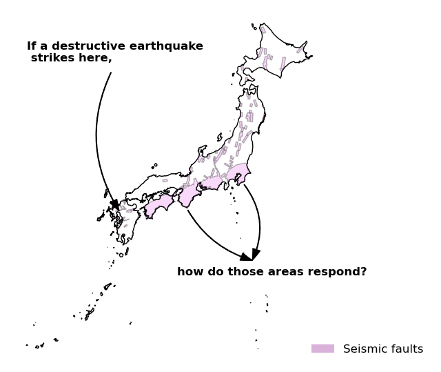

This website shows my master’s thesis in progress and will be updated frequently. Its main objectives are to present real-time progress to my supervisors and to showcase my code, as well as beautiful maps (stay tuned!)—since I really enjoy working with spatial data.

## Intuition

My master's thesis investigates the social costs of being exposed to seismic risk. I decide to focus on the impacts of risk mapping on housing prices in exposed areas. The basic ideal goes as it follows:

{fig-align="center"}

## What should we care?

Taking a step back, this work addresses the following questions: what is the risk premium people have to pay to live in safer places? Are people willing to stay in areas under the threat of natural disasters? Are housing spatial inequalities being reshaped by risk mapping to some extent? Are they even aware of such threats, despite the sensitization policies?

As for Japan, this is a particularly burning issue. The country frequently experience earthquakes, and it is likely to be struck by what is called a mega-earthquake in the next 30 years (Nankai Through), experts say. On a global scale, The so-called "The big One" mega-earthquake is believed to strike Asia as well as along Western North America. The important thing with earthquakes is that one cannot tell when they occur, so that it threatens everywhere every time.

The same logic may apply to climate change. As other types of natural disasters are increasing (such as floods, droughts and typhoons among others), investors as well as policy makers may be interested in the real cost of investing in this type of areas.

## Contribution

This work relies on many papers that have studied the impact of earthquakes, and other types of natural disasters (see literature review section ???). The papers brings two contributions to the existing literature:

-   It investigates the housing market, including the rental market, thanks to the use of a new data set not used in previous studies.

-   It includes a panel survey and bridges a gap between objective risk impact and subjective perception.
