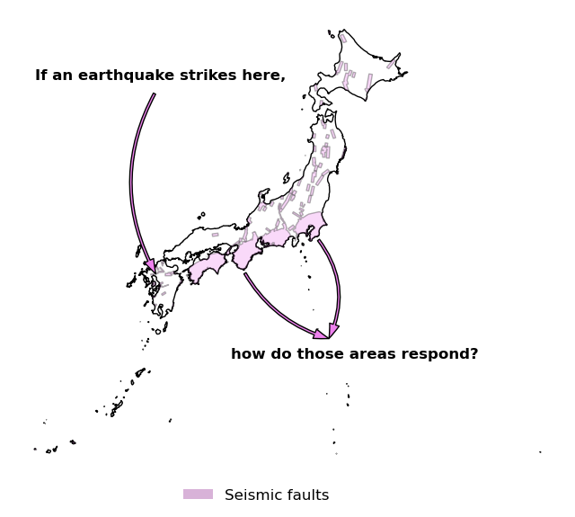

This website shows my master’s thesis in progress and will be updated frequently. Its main objectives are to present real-time progress to my supervisors and to showcase my code, as well as beautiful maps (stay tuned!)—since I really enjoy working with spatial data.

## Intuition

My master's thesis investigates the social costs of being exposed to seismic risk. I decide to focus on the impacts of risk mapping on housing prices in exposed areas. The basic ideal goes as it follows:

## Motivation

What should we care?

Taking a step back, this work addresses the following questions: are people willing to leave in more risk exposed areas? Are they even aware where are the more likely threats, despite the sensitization policies? Are people's responses different when such a natural disaster occurs?

Japan is likely to experience a big earthquake in the next 30 years, namely the Nankai Through. However, seismic risk more broadly threatens other places, such as The Big One megatrust eathquake, which is anticipated along Western North America.

Finally, the same logic may apply to climate change.

## Contribution

This work relies on many papers that have studied the impact of earthquakes, and other types of natural disasters (see literature review section ???). The papers brings two contributions to the existing literature:

-   It investigates the housing market, including the rental market, thanks to the use of a new data set not used in previous studies.

-   It includes a panel survey and bridges a gap between objective risk impact and subjective perception.

## Data
