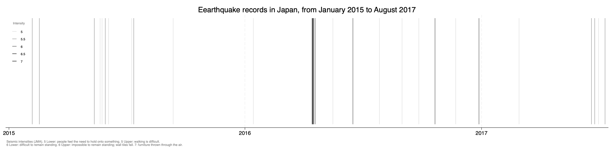
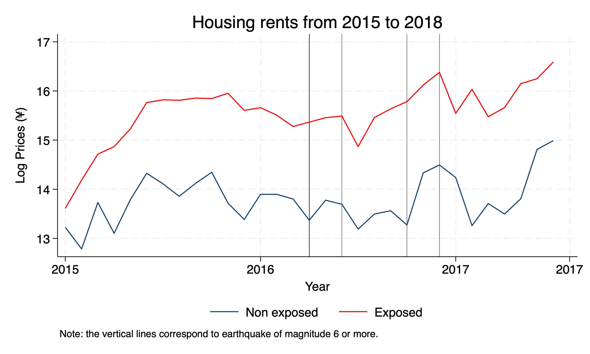

## Intuition

{fig-align="center"}

## Research Question & Motivation

::: {.callout-tip title="Research Question" icon="false"}
How information shocks such as natural disasters modify risk aversion in housing prices depending on exposure to risk?
:::

::: incremental
-   **Why does it matter?**
-   **People's awareness** and **Risk aversion** to natural disasters
-   **Investors** and the **safety premium**
-   in the long run, might drive **inequalities**
-   **Intensifying disasters**: floods, hurricanes, wildfires, and droughts.
:::

## Theoretical Part

::: callout-caution
## Still in progress

Let $p$ be the subjective probability of a earthquake to happen. $p$ depends on $i$, the information set available, and $r$, the objective attributes that make such an event more likely. Then the HPF is:

$$P = P(Z, r, p(i, r))$$

Expected utility becomes:

$EU = p(i, r) \cdot U^E[Z, r, Q] + (1 - p(i, r)) \cdot U^{NE}[Z, r, Q]$

Given the budget constraint $M = P(Z, r, p(i, r)) + Q$ (with $Q$ being a composite commodity), the maximization of utility is given by:

$\frac{\partial P}{\partial p}=\frac{U^{E} - U^{NE}}{p(i,r)\frac{\partial U^{E}}{\partial Q}+\left(1 - p(i,r)\right)\frac{\partial U^{NE}}{\partial Q}}$
:::

## Empirical Analysis: A Literature Review

Many papers on natural disasters and their consequences on housing prices (@brookshire_test_1985, @hidano_effect_2015, @balboni_harms_2025 among many others).

My work heavily relies on @ikefuji2022.

**My main contribution:**

::: {.incremental}
-   Extending the analysis to the housing market
:::

## Data (1)

::::::: columns
:::: {.column width="50%"}
::: {.callout-note icon="false"}
## Risk mapping data

-   **Japan Meteorological Agency Records (JMA)**
-   all earthquakes records
-   coordinates / magnitude
-   **Japan Seismic Hazard Information Station (J-SHIS)**
-   risk hazard maps for every year
-   [accuracy: 250m $\times$ 250m]{style="color: blue;"}
:::
::::

:::: {.column width="50%"}
::: {.callout-note icon="false"}
## Real estate data

-   **Liffull Homes**
-   One the main real estate agencies in Japan
-   listings of rentals and sales across Japan from 2015 to 2024
-   70GB of data
-   [coordinates]{style="color: blue;"}
-   sqft, distance to the station, building materials, etc.
:::
::::

[I collect demographic data from the Japanese census via **E-stat** (aggregated at the municipality level).]{style="font-size: 0.75em; color: gray;"}
:::::::

## Data (2)

[Official 2020 seismic hazard map from the J-SHIS]{style="font-size: 0.85em; color: black; display: block; text-align: center; margin-bottom: 0.1rem;"}

[$p$ = probability that an earthquake of intensity 5 or more will hit in the next 30 years.]{style="font-size: 0.7em; color: gray; display: block; text-align: center; margin-bottom: 0.5rem;"}

{fig-align="center"}

::::::::::::: {style="display: flex; flex-direction: column; align-items: center; gap: 0.4rem; font-size: 0.65em; margin-top: 0.5rem;"}
::::::: {style="display: flex; justify-content: center; gap: 1.5rem;"}
:::: {style="display: flex; align-items: center; gap: 0.4rem; border-bottom: 1px solid #ccc; padding-bottom: 0.2rem;"}
::: {style="width: 14px; height: 14px; background: #FFD700; border-radius: 2px;"}
:::

$p < 0.03$
::::

:::: {style="display: flex; align-items: center; gap: 0.4rem; border-bottom: 1px solid #ccc; padding-bottom: 0.2rem;"}
::: {style="width: 14px; height: 14px; background: #FF6600; border-radius: 2px;"}
:::

$0.03 < p < 0.06$
::::
:::::::

::::::: {style="display: flex; justify-content: center; gap: 1.5rem;"}
:::: {style="display: flex; align-items: center; gap: 0.4rem; border-bottom: 1px solid #ccc; padding-bottom: 0.2rem;"}
::: {style="width: 14px; height: 14px; background: #CC0000; border-radius: 2px;"}
:::

$0.06 < p < 0.26$
::::

:::: {style="display: flex; align-items: center; gap: 0.4rem; border-bottom: 1px solid #ccc; padding-bottom: 0.2rem;"}
::: {style="width: 14px; height: 14px; background: #6B0080; border-radius: 2px;"}
:::

$p > 0.26$
::::
:::::::
:::::::::::::

## Empirical Strategy (1)

Difference-in-Differences Methodology

::: incremental
-   Treated group: [$p > 0.26$]{style="color: #6B0080;"}
-   Control group: [$p < 0.06$]{style="color: #FFD700;"}
-   I discard the observations with intermediate values
-   Let's denote $\text{Exposed}_i = \begin{cases} 1 & \text{if } p_i > 0.26 \\ 0 & \text{if } p_i < 0.06 \end{cases}$
-   I may consider a continuous treatment in the future
-   But what about the **information shocks**?
:::

## Empirical Strategy (1)

Difference-in-Differences Methodology

::: incremental
- I consider the **earthquakes of intensity 5 or more**.
- I will call them "big earthquakes".
:::

::: fragment
{fig-align="center"}
:::

## Descriptive statistics

{fig-align="center"}

## Empirical Strategy (2)

:::: {.callout-warning title="In progress"}
::: {style="font-size: 0.8em; text-align: center;"}
$$
\begin{aligned}
\ln P_{it} = \alpha_0 &+ \sum_{j=1}^{J} \alpha_j Z_{ij} + \beta r_i + \gamma Exposed_i + \delta Post_{it} \\
&+ \theta_t (Post_{it} \times Exposed_i) + \varepsilon_{it}
\end{aligned}
$$
:::
::::

::: {style="font-size: 0.6em; line-height: 1.2;"}
-   $ln P_{it}$: Log Price
-   $Z_{ij}$: vector of property and location controls
-   $r_i$: prefecture and year fixed effects
-   $Exposed_i$: baseline seismic risk exposure
-   $Post_{it}$: Announce $i$ is published $x$ days after a "big earthquake". Right now $x = 30$.
-   $Post_{it} \times Exposed_i$: interaction capturing treatment effects
:::

## Results

```{=html}
<div style="display: flex; justify-content: center; align-items: center; height: 70vh;">
  <style>
    @keyframes spin {
      to { transform: rotate(360deg); }
    }
    .loader {
      width: 50px; height: 50px;
      border: 5px solid #333;
      border-top-color: white;
      border-radius: 50%;
      animation: spin 1s linear infinite;
    }
  </style>
  <div class="loader"></div>
</div>
```

## In the near future

Things I have to work on:

- Redo the regression tables with a cleaner code
- Select the right controls
- Think about the FE
- Generate more descriptive statistics

Caveats:

- No control for other types of risk

## References
