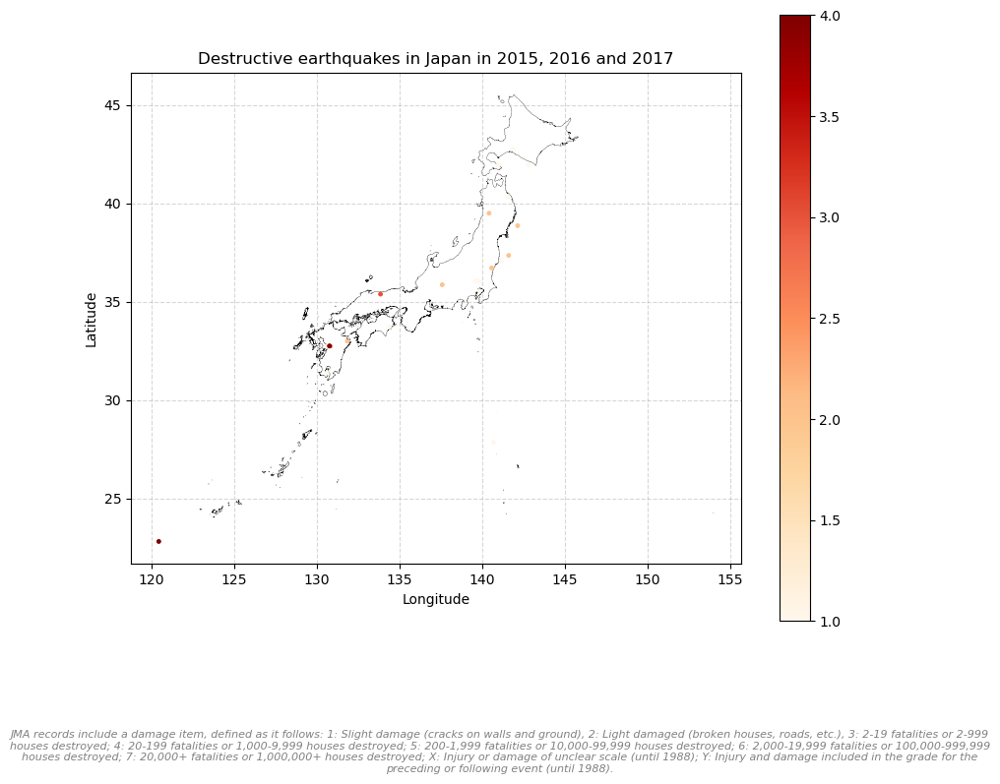

## Research Question & Motivation

::: {.callout-note title="Research Question"}
[How costly it is to be exposed to natural disasters?]{style="color: #C0392B;"}
:::

**Why does it matter?**

Intensifying disasters with climate change.

Disasters: floods, hurricanes, wildfires, and droughts.

In Japan: earthquakes, tsunamis.

**The setting**: Hazard risk mapping in Japan and its consequences on real estate prices.

## Literature review

Many papers on natural disasters and their consequences on housing prices (@brookshire_test_1985, @hidano_effect_2015, @balboni_harms_2025 among many others).

My work heavily relies on @ikefuji2022.

**My main contributions:**

-   What about the unaffected areas but still at risk?

-   Extending the analysis to the housing market

-   Controling for other type of risk (not done by the authors)

## Data (1)

::::::: columns
:::: {.column width="50%"}
::: {.callout-note icon="false"}
## Risk mapping data

-   **Japan Meteorological Agency Records (JMA)**
-   all earthquakes records
-   coordinates / magnitude
-   **Japan Seismic Hazard Information Station (J-SHIS)**
-   risk hazard maps
-   change over time
:::
::::

:::: {.column width="50%"}
::: {.callout-note icon="false"}
## Real estate data

-   **Ministry of Land, Infrastructure, Transport and Tourism (MLIT)**
-   accurate description of the properties (nearest station, type of use, etc.)
-   **LIFULL HOMES**
-   70GB of housing information
-   including rentals
-   two limitations: estimation only,, from 2015 to 2016 only
:::
::::
:::::::

**Possible extension**: Panel Data from Keio University.

## Data (2)

::::: columns
::: {.column width="50%"}

:::

::: {.column width="50%"}

:::
:::::

## Data (3)

## Empirical Strategy

### What about the counterfactual?

::: incremental
-   Event Study
-   Synthetic Control Method (SCM)
:::

:::: fragment
::: {style="text-align: center;"}
*Thank you for your attention!*
:::
::::

## References
