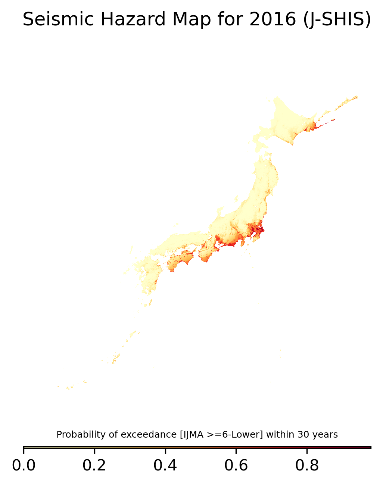

```{r}
#| echo: false
#| message: false
#| error: false
library(tidyverse)
library(tibble)
library(kableExtra)
```

This page describes the data management of this work, from the pre-processing steps to the results. The goal is to write step by step a replication package. However, note that some data are not public and should be required to their owners (namely the LIFFULL HOMES dataset the panel dataset from Keio University).

## Cleaning and visualizing

Most of the data are already really clean. This section provides examples of my code pre-processing the data. Code used in this section: `Python`, with `pandas`, `geopandas` and `duckdb`, and `SQL`.

#### JMA Records

Let's visualize the JMA variables:

```{r}
#| echo: false
jma_head <- read.csv("/Users/anthony/Documents/master_thesis/data/raw/jma/jma_combined.csv", nrows = 1)

jma_head |>
  kable(caption = "Variables of JMA records") |>
  scroll_box(height = "200px",
             width = "100%")
```

JMA records include all seismic activity observations. They are to be converted to csv first, ensuring that they are well encoded.

Records include of course latitude and longitude in DMS format. Then the following code convert those variables in the CRS WGS84 (epsg:4326) format:

```{python}
#| eval: false
# Convert latitude_deg / lat and longitude_deg / lon in DMS to WGS84 (epsg:4326)
def dms_to_decimals(latlon_deg: int = 31, latlon: int = 1176):
    minute = latlon // 100
    second = latlon % 100
    return latlon_deg + minute / 60 + second / 3600
  
jma_damage["latitude"] = jma_damage.apply(
    lambda row : dms_to_decimals(row["latitude_deg"], row["lat"]),
    axis = 1)

jma_damage["longitude"] = jma_damage.apply(
    lambda row : dms_to_decimals(row["longitude_deg"], row["lon"]),
    axis = 1)
```

The records include a "damage \_class" variable where damages are recorded.


#### J-SHIS Hazard Maps

Many parameters are available, and have an impact on what the hazard maps look like. I decide to focus on columns 02 and 04 since there are presented as the most common for public hazard map information to the public:

```{r}
#| echo: false

df <- tibble(
  Column = sprintf("%02d", 1:23),
  Header = c(
    "CODE",
    "T30_I45_PS", "T30_I50_PS", "T30_I55_PS", "T30_I60_PS",
    "T30_P03_SI", "T30_P03_BV", "T30_P03_SV",
    "T30_P06_SI", "T30_P06_BV", "T30_P06_SV",
    "T50_P02_SI", "T50_P02_BV", "T50_P02_SV",
    "T50_P05_SI",
    "T50_P05_BV", "T50_P05_SV",
    "T50_P10_SI", "T50_P10_BV", "T50_P10_SV",
    "T50_P39_SI", "T50_P39_BV", "T50_P39_SV"
  ),
  Format = c(
    "%10-11c",
    rep("%9.6e", 4),
    "%3.1f", "%9.6e", "%9.6e",
    "%3.1f", "%9.6e", "%9.6e",
    "%3.1f", "%9.6e", "%9.6e",
    "%3.1f",
    "%9.6e", "%9.6e",
    "%3.1f", "%9.6e", "%9.6e",
    "%3.1f", "%9.6e", "%9.6e"
  ),
  Explanation = c(
    "250m mesh code",
    "Probability of exceedance [IJMA >=5-Lower] within 30 years",
    "Probability of exceedance [IJMA >=5-Upper] within 30 years",
    "Probability of exceedance [IJMA >=6-Lower] within 30 years",
    "Probability of exceedance [IJMA >=6-Upper] within 30 years",
    "IJMA for a 3% probability of exceedance within 30 years",
    "PBV for a 3% probability of exceedance within 30 years (cm/s)",
    "PGV for a 3% probability of exceedance within 30 years (cm/s)",
    "IJMA for a 6% probability of exceedance within 30 years",
    "PBV for a 6% probability of exceedance within 30 years (cm/s)",
    "PGV for a 6% probability of exceedance within 30 years (cm/s)",
    "IJMA for a 2% probability of exceedance within 50 years",
    "PBV for a 2% probability of exceedance within 50 years (cm/s)",
    "PGV for a 2% probability of exceedance within 50 years (cm/s)",
    "IJMA for a 5% probability of exceedance within 50 years",
    "PBV for a 5% probability of exceedance within 50 years (cm/s)",
    "PGV for a 5% probability of exceedance within 50 years (cm/s)",
    "IJMA for a 10% probability of exceedance within 50 years",
    "PBV for a 10% probability of exceedance within 50 years (cm/s)",
    "PGV for a 10% probability of exceedance within 50 years (cm/s)",
    "IJMA for a 39% probability of exceedance within 50 years",
    "PBV for a 39% probability of exceedance within 50 years (cm/s)",
    "PGV for a 39% probability of exceedance within 50 years (cm/s)"
  )
)

df |>
  kable(caption = "Variables of the J-SHIS shapefy file") |>
  scroll_box(
    height = "170px",
    width = "100%"
  )
```

This is what it looks like:

{width="789"}

#### LIFULL HOMES Dataset

#### MLIT Dataset

### Panel Data

## Combining the data

------------------------------------------------------------------------

[Back to Home](index.html)
